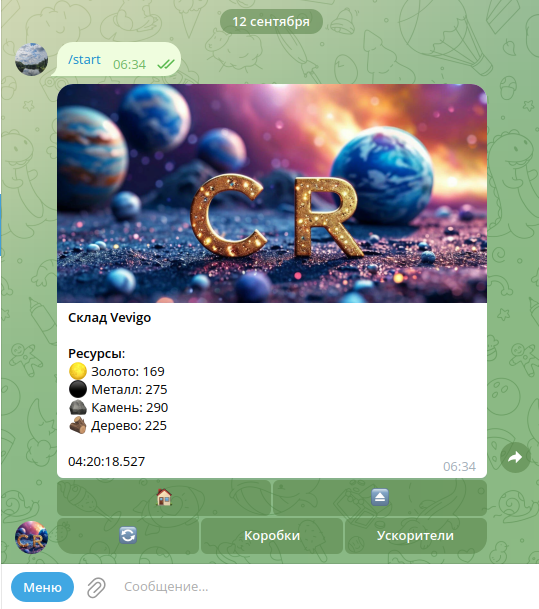
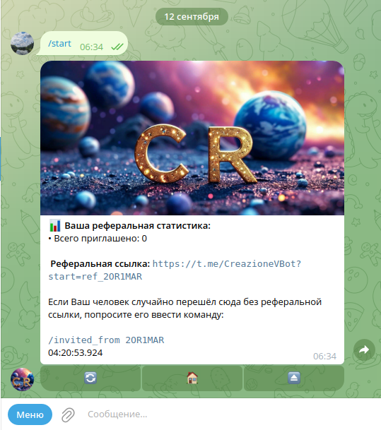
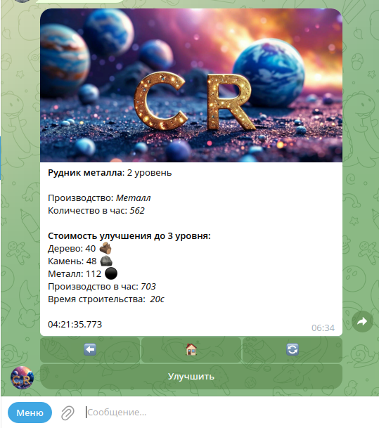

# Creazione - Игровой Telegram бот
<div align="center">


[](https://t.me/YourBotName)
[](LICENSE)

</div>

## 📖 Описание

Creazione - это серверная часть игрового Telegram-бота с собственной экономической моделью.
Игроки могут строить и улучшать здания, накапливать ресурсы, приглашать друзей через реферальную систему и получать ежедневные награды.

## ✨ Возможности

- 🏗️ Система строительства и улучшения зданий с нелинейной прогрессией
- 💰 Экономическая модель с производством ресурсов
- 👥 Реферальная программа с вознаграждениями
- 🎁 Ежедневные бонусы и лутбоксы
- ⚡ Кэширование данных с использованием Redis
- 🔧 Автоматические задачи с Spring Scheduling
- 🐳 Полная контейнеризация с Docker Compose

## 🛠 Технологический стек

### Backend
- **Java 21** - основной язык программирования
- **Spring Boot 3.5.4** - основной фреймворк
- **Spring Data JPA** - работа с базой данных
- **Spring Scheduling** - планировщик задач

### Базы данных
- **PostgreSQL 15** - основное хранилище данных
- **Redis 7** - кэширование и хранение сессий

### Инфраструктура
- **Docker** - контейнеризация приложения
- **Docker Compose** - оркестрация контейнеров
- **Liquibase** - управление миграциями базы данных

### Внешние интеграции
- **Telegram Bot API** - взаимодействие с Telegram
- **Gradle** - система сборки

## 📦 Установка и запуск

### Предварительные требования

- Docker 20.10+
- Docker Compose 2.0+
- Java 21 (для разработки)

### Запуск с помощью Docker Compose

1. Клонируйте репозиторий:
```bash
git clone https://github.com/VevigoVR/game-telegram-bot.git
```

2. Создайте файл `.env` в корневой директории (на основе `.env.example`):
```bash
cp .env.example .env
```

3. Заполните файл `.env` необходимыми значениями:


4. Запустите приложение:
```bash
docker-compose up -d
```

Приложение будет доступно внутри Docker-сети. Для доступа к базе данных извне можно раскомментировать и настроить порты в `docker-compose.yml`.

### Локальная разработка

1. Убедитесь, что установлены Java 21 и Gradle
2. Запустите PostgreSQL и Redis через Docker Compose:
```bash
docker-compose up db redis -d
```
3. Запустите приложение в режиме разработки:
```bash
./gradlew bootRun --args='--spring.profiles.active=dev'
```

## 📁 Структура проекта

```
creazione-bot/
├── src/main/java
│   └── com/creazione/space_learning
│       ├── controllers/      # REST контроллеры
│       ├── entities/         # Сущности БД
│       ├── repositories/     # Репозитории Spring Data
│       ├── game/             # Игровые сущности
│       ├── queries/          # Обработчики команд
│       ├── services/         # Бизнес-логика
│       ├── config/           # Конфигурационные классы
│       └── Application.java  # Главный класс приложения
├── src/main/resources
│   ├── application.yml       # Основные настройки
│   ├── application-dev.yml   # Настройки для разработки
│   └── application-prod.yml  # Настройки для production
├── docker-compose.yml        # Docker Compose конфигурация
├── Dockerfile               # Docker образ приложения
└── .env                     # Переменные окружения (не в репозитории)
```

## 🚀 Деплой

### Production-сборка

1. Соберите JAR-файл и docker-compose:
```bash
bash lingua-start.sh
```


## 📞 Контакты

Виктор Рябченко - [@Vevigo](https://t.me/Vevigo) в Telegram

Ссылка на проект в Telegram: [@CreazioneVBot](https://t.me/CreazioneVBot)

## 🙏 Благодарности

- Команда Skillbox за качественное обучение
- Сообщество Spring за отличную документацию
- Разработчикам Telegram Bot API за простой и мощный API

---
<div align="center">



</div>

<div align="center">

**Наслаждайтесь игрой!** 🎮

</div>